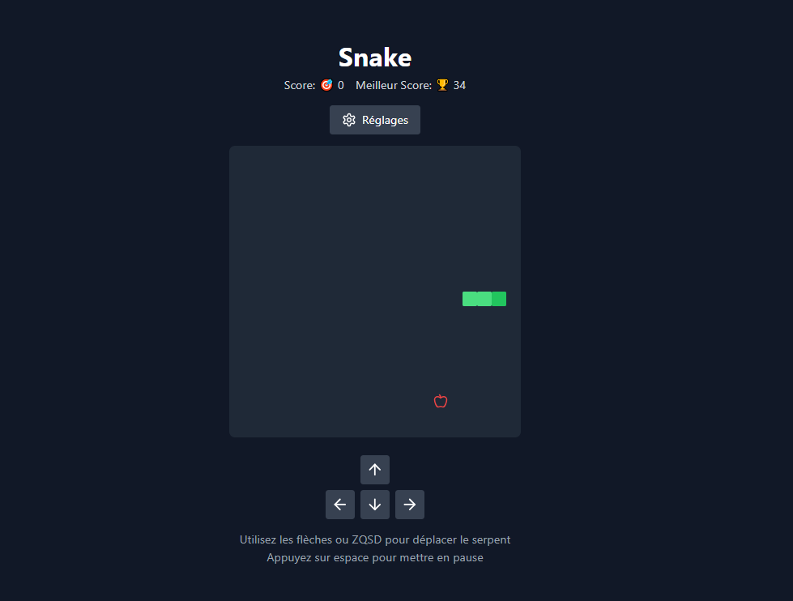

# 🐍 Snake Game React

Un jeu du serpent moderne et élégant construit avec React, TypeScript et Tailwind CSS. Ce projet propose plusieurs modes de jeu, une gestion des erreurs robuste, un suivi des meilleurs scores et des contrôles réactifs.



## ✨ Caractéristiques

### 🎮 Modes de Jeu
- **Mode Classique** : Le jeu traditionnel avec collisions
- **Mode Portail** : Traversez les murs pour réapparaître de l'autre côté
- **Mode Fantôme** : Passez à travers votre corps sans danger

### 🏃‍♂️ Vitesses de Jeu
- **🐌 Lent** : Parfait pour débuter
- **🚶 Normal** : L'expérience classique
- **🐇 Rapide** : Pour les experts

### 📏 Tailles de Terrain
- **Petit** : 15x15 cases
- **Moyen** : 20x20 cases
- **Grand** : 25x25 cases

### 🎯 Contrôles
- Clavier : ZQSD ou Flèches directionnelles
- Boutons tactiles pour mobile
- Barre d'espace pour :
  - Pause/Reprise pendant le jeu
  - Redémarrage rapide après "Game Over"

### 💾 Fonctionnalités
- Sauvegarde automatique du meilleur score
- Interface moderne avec Tailwind CSS
- Animations fluides
- Design responsive
- Gestion des erreurs robuste

## 🛠️ Technologies

- React 18
- TypeScript
- Tailwind CSS
- Vite
- Lucide React (icônes)

## 🎮 Comment Jouer

1. **Démarrage**
   - Cliquez sur "Commencer" ou configurez vos préférences dans "Réglages"
   - Choisissez votre mode et vitesse de jeu

2. **Contrôles**
   - ZQSD ou Flèches pour diriger le serpent
   - Espace pour pause/reprise
   - Boutons à l'écran pour les appareils tactiles

3. **Objectif**
   - Mangez les pommes pour grandir
   - Évitez les collisions selon le mode choisi
   - Battez votre meilleur score !

## 📦 Installation

1. Clonez le dépôt :
   ```bash
   git clone https://github.com/votre-nom/snake-game-react.git
   ```

2. Installez les dépendances :
   ```bash
   cd snake-game-react
   npm install
   ```

3. Lancez le serveur :
   ```bash
   npm run dev
   ```

## 🚀 Déploiement

1. Construisez le projet :
   ```bash
   npm run build
   ```

2. Les fichiers de production seront dans `dist`

3. Déployez sur votre plateforme préférée :
   - **Netlify** : Connectez votre dépôt et c'est parti !
   - **Vercel** : Import automatique et déploiement instantané

## 🔧 Structure du Projet

```
src/
├── App.tsx        # Logique principale du jeu
├── index.css      # Styles Tailwind
└── main.tsx       # Point d'entrée
```

## 🤝 Contribution

1. Forkez le projet
2. Créez votre branche (`git checkout -b feature/nouvelle-fonctionnalite`)
3. Committez vos changements (`git commit -m 'Ajout nouvelle fonctionnalité'`)
4. Poussez vers la branche (`git push origin feature/nouvelle-fonctionnalite`)
5. Ouvrez une Pull Request

## 📝 Licence

Ce projet est sous licence MIT - voir le fichier [LICENSE](LICENSE) pour plus de détails.

## 🙏 Remerciements

- Inspiré du jeu Snake classique
- Icônes par [Lucide React](https://lucide.dev)
- Propulsé par [Vite](https://vitejs.dev)
